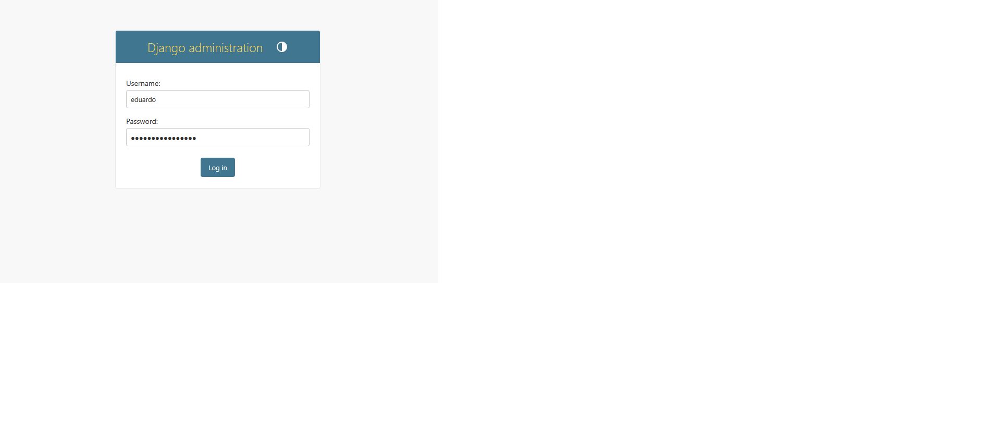
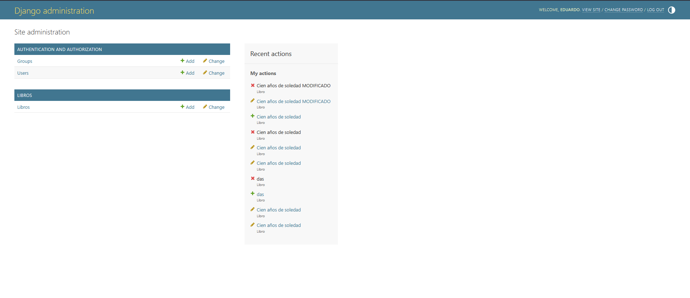
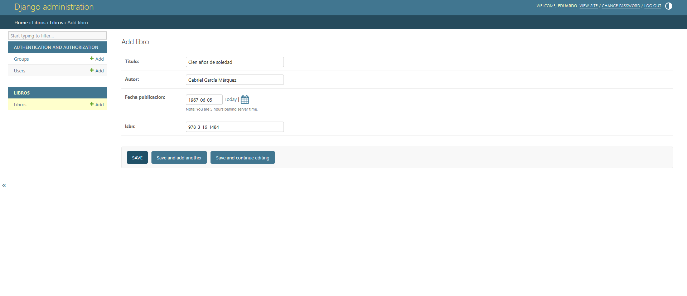
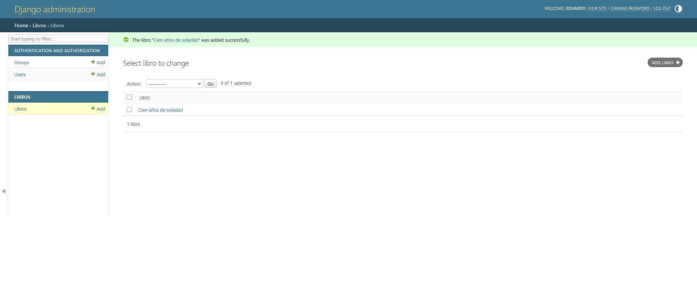
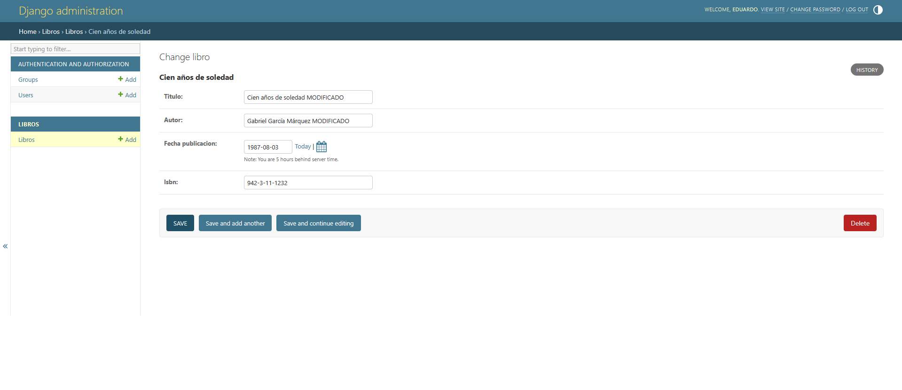
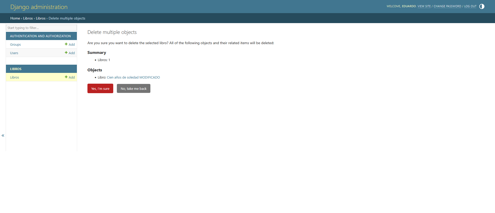

# 📚 Sistema de Gestión de Libros

Este es un sistema desarrollado con Django que permite gestionar un catálogo de libros. Incluye operaciones CRUD: crear, leer, actualizar y eliminar libros.

## 🚀 Funcionalidades

- Agregar libros con título, autor, ISBN, editorial y fecha de publicación.
- Listar todos los libros registrados.
- Editar información de libros existentes.
- Eliminar libros del sistema.
- Panel de administración con Django Admin.

## 🛠️ Tecnologías utilizadas

- Django 5.2.1
- Python 3.13.3
- Base de datos SQLite
- HTML + Bootstrap (opcional si usaste templates personalizados)

## 🖼️ Capturas del sistema

1. Logeo - Menu
   

2. Página principal - Lista de libros  
   

3. Formulario para agregar libro  
   

4. Lista Libro
   

5. Formulario para editar libro  
   

6. Confirmación de eliminación de libro  
   

7. Lista libro actualizada (opcional)  
   

## ▶️ ¿Cómo ejecutar el proyecto?

### 1. Clona el repositorio
```bash
git clone https://github.com/tu-usuario/gestion_libros.git
cd gestion_libros


2. Activa el entorno virtual

.\venv\Scripts\activate   # En Windows
# o
source venv/bin/activate  # En Linux/macOS

3. Instala dependencias

pip install -r requirements.txt

4. Ejecuta migraciones

python manage.py makemigrations
python manage.py migrate

5. Crea un superusuario (para entrar al admin)
python manage.py createsuperuser

6. Ejecuta el servidor
python manage.py runserver

Luego abre en tu navegador:
http://127.0.0.1:8000/libros/

📦 Cómo generar el archivo requirements.txt

Dentro de tu entorno virtual:
pip freeze > requirements.txt

👨‍💻 Autor

Christopher Eduardo Valdivia Baca
📍 Estudiante de Computación e Informática — Cibertec Callao
🔗 LinkedIn
📧 eduardovaldivia130@outlook.es
📱 +51 953 587 619

